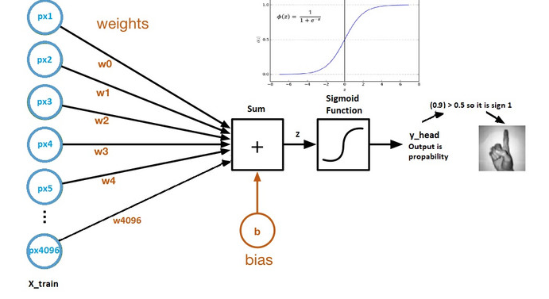

# Pytroch-ile-Logistic-Regression

# Pytorch Nedir?

Zaman içerisinde makine ögrenmesi algoritmaların problemlere çözüm olmasının azalmasıyla birlikte, verilerin boyutunun her geçen gün artmasıyla 
Deep Learning algoritmaların kullanılması da artmaktadır. Bu kapsam da ses tanıma, görüntü işleme, görüntü sınıflandırma, nesne tanıma vb. çalışmalarda 
derin ögrenme algoritmaları daha başarılı sonuçlar üretmiştir. Tüm bu işler yapılırken aynı zaman da zaman dan kazanmak için hız gereksinimi dogmuştur.
Bu bağlamda bakıldığında Pytorch derin ögrenme algoritmarın hızlı çalışmasını sağlayan açık kaynak bir python kütüphanesidir.

Pytorch ekran kartlarını kullanabilen ve böylelikle sağladığı hız bakımından oldukça popüler bir kütüphanedir.Pytorch'un başarılı olmasının nedenlerinden
bir tanesi de sinir ağı modelleri zahmetsizce oluştura bilmesidir. Pytorch aynı anda CPU ve GPU gibi arka planda başka işler için yapıları kullanabilir.
Pytorch'un Numpy kütüphanesine benzer kendi bir Tensor yapısı mevcuttur.

# Logistic Regression Nedir ve Nasıl Çalışır?

Logistic Regression sınıflandırma modelleri için kullanılabilen 0 ve 1 gibi akla gelen ilk sınıflandırma regressionlarında bir tanesidir. Aynı zamanda
yapay sinir ağları içinde bir temel oluşturmaktadır. Logistic regression ile birlikte sinir ağı kelimesinden bahsedilmeye başlanılmıştır. Derin ögrenme 
algoritmalarından farkı tek katmanlı olmasıdır. İlerleyen yazılarda katman ve derin kelimerin anlamlarından da bahsedilecektir.

  -Logistic Regression Hesaplama Grafiği
     
 

Genel Olarak Logistic Regression girdilerin weight'lerin transpozu ile çarpılarak üzerine de bias eklenerek çalışmaktadır. 

z=(w.t)x+b

Bu aşamadan sonra a çıktısı bir tane activasyon fonksiyonuna eklenerek y_head(tahmin) değeri alde edilmiş olur.

y_head(tahmin)=sigmoid(z)

Kısaca Logistic Regressiondan bahsettikten sonra artık Pytorch ile nasıl model oluşturulur adım adım ilerleyelim.

# Dataset

Kullanılan veri seti kaggle'dan elde edilmiştir. Link bilgisi aşağıdaki gibidir.

![https://www.kaggle.com/datasets/zalando-research/fashionmnist]

Veri setinden kısaca bahsedilecek olursa içerisinde 28*28 pikselden oluşan içerisinde 60000 train(eğitim) ve 10000 test verilerinden oluşan
içerisinde 10 sınıf barındırıan bir veri setidir. Burada piksel değerleri 0 ile 255 arasındadır. Her bir resim 784 pikselden oluşmaktadır.

